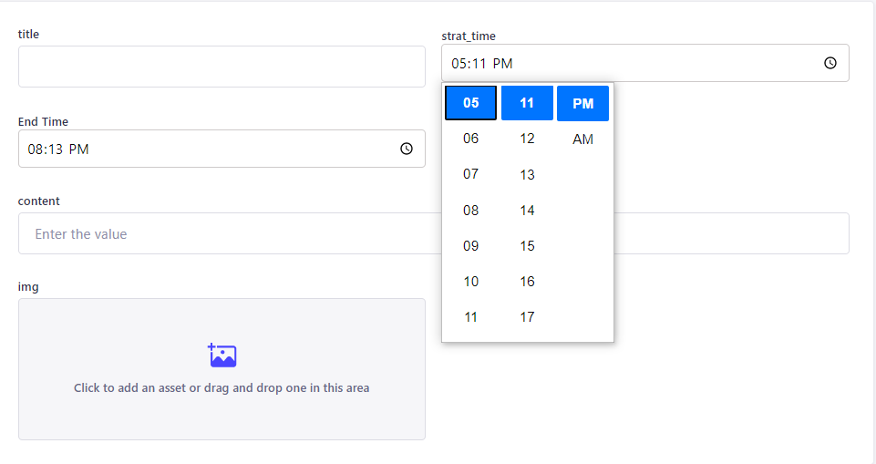

# Custom Timer - Strapi Custom Field

The timer plugin is used to easily add the time in collection types. This plugin helps to easily add time.

## Getting Started

The plugin can be used in strapi version above 4.4 (versions that support custom fields).

### To Install

1. Go into your strapi project.
2. Run the npm command
     npm i custom-timer
3. The plugin will be added to your strapi project.

## How To Use

   1. Create a new field from a content type.
   2. Select custom fields.
   3.  **Custom Timer** field will appear there.
   4. Select this field and name it accordingly.
